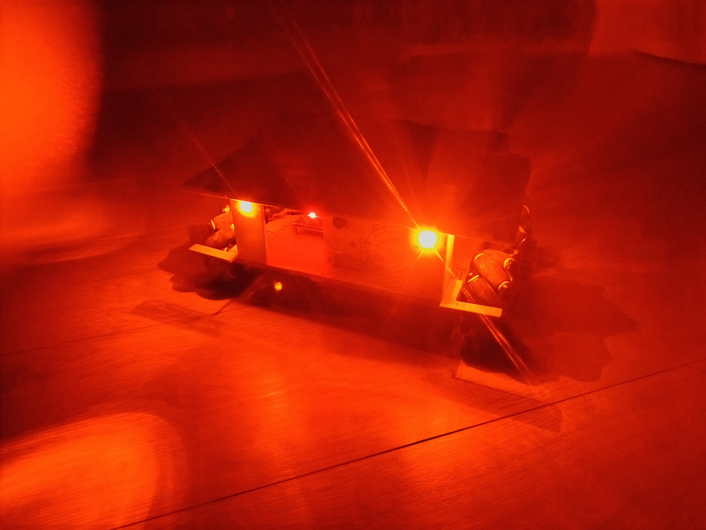

# КРАБ-2 - Колісний Радіокерований Активний Безпілотник



## Опис

```КРАБ-2``` - друга версія цього дрона (перша нікуди не поїхала і розвалилась). Це наземний дрон з колесами meccanum та камерою. Система складається з двох мікроконтролерів:

* ```ESP32-CAM``` — для відеотрансляції та керування;
* ```Arduino``` (з шилдом для моторів) — для безпосереднього керування гусеницями.

Сам дрон керується з телефона через встановлений додаток. Телефон повинен бути підключеним до WI-FI точки доступу ```ESP-32-CAM```. Ось так виглядає інтерфейс програми:


## Компоненти та інструменти

### Головний мікроконтроллер

* ```ESP32-CAM``` з камерою

* ```Стандартний програматор для ESP-32-CAM```, оскільки модуль вище немає USB-порту.
* ```Антена Wi-Fi 2.4ГГц 3dBi SMA-plug IPX``` для кращого з'єднання (до 10м)


#### Опціонально:

* ```Камера для ESP-32-CAM на 160 або 120``` для кращого куту огляду
* ```Радіатор``` для охолодження
* ```Теплопровідна клейка стрічка``` двохстороння для кріплення радіатора

### Допоміжний мікроконтроллер

* ```Arduino Uno```
* ```Arduino Motor Shield``` для 4-ох моторів


#### Альтернатива

* ```Raspberry Pi Pico``` (будь-яка версія)
* ```Шилд керування 4-ма моторами для Raspberry Pi Pico```


Я використовував та задокументував тут лише варіант з ```Arduino Uno```, проте у версії з ```Raspberry Pi``` залишаються вільні піни для підключення переферійних пристроїв, наприклад манімуляторів, датчиків тощо. Якщо оберете цей шлях, вам потрібно буде самостійно переписати код.

### Засоби переміщення

* 4 звичайних (жовтих) мотори на ```9В з редуктором 1:48```
* 2 комплекти коліс ```meccanum``` по 2 колеса (ліве та праве)


### Живлення

Я використав:

* Літій-іонну батарею URGENEX ```7,4 В 2000 мАг 2S```


В комплекті до неї йде зарядний пристрій та запасний акумулятор. Проте, ви можете взяти будь-який акумулятор на ```7,4В```, але це має бути достатньо потужний акумулятор. Крім цього, ви можете навіть взяти 2 акумулятори типу ```18650``` та з'єднати їх послідовно.

* Модуль лінійного стабілізатора з ```6.5-12В на 5.0В на AMS1117```


Використовується для живлення ESP-32-CAM. Живлення з 5В піна на Arduino може не вистачити, тому краще використати його.

* ```Ремінець-липучка``` мінімум 2шт для акумулятора, або інший спосіб фіксації акумулятора
* ```T-Конектор``` для акумулятора, або інший необхідний вам

### Корпус

* Фанера ```3мм А4``` 2 листа
* Фанера ```5-6мм А4```1 лист

### Додатково

* 4-канальний ```перетворювач логічних рівнів```


* ```Клемник подвійний 5мм``` для підключення дротів до монтажної плати
* Будь-який справний ```вимикач```
* ```Конектори Dupont тато``` для пайки
* ```Конектори Dupont мама``` для встановлення модулів
* ```Монтажна плата 50х70мм```
* Додаткова ```монтажна плата``` для нарізання на модулі мигалок, розмір неважливий
* ```Міжплатні стійки М3```, рекомендую брати набором


* ```Набір гвинтів М3```, теж рекомендую зразу набір


* ```Динамік 8Ом``` для сирени
* ```Резистор 220Ом``` 8-10шт, краще взяти запасні
* ```Світлодіод``` помаранчевий (або за смаком) 3мм або 5мм ультраяскравий
* `Перемички` для макетної плати, рекомендую взяти такий комплект


* ```Перемички 20см``` мама-мама, тато-мама
* `Дріт` для з'єднання моторів, акумулятора, світлодіодів за смаком
* `Термозбіжні трубки` діаметром 8-10мм, 5мм бо так буде охайніше

### Інструменти

* Шурупокрут з свердлами
* Інструменти для пайки
* Інструменти для нарізання та обробки фанери
* Клей-пістолет
